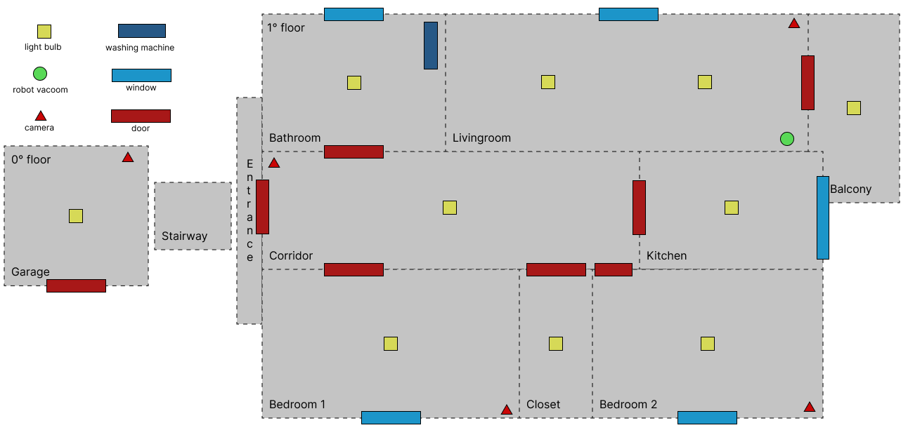

# Assignment 2

Added `Microwave` as device, that automatically starts at a certain hour.

Implemented `PersonSensor` to follow one of the two required `Person` (where I added the `prev_room` attribute), switching on and off the light based on their movement. This is performed using an `Intention` and `Goal` with the `HouseAgent`.

The main file is `my_scenario` that, as required from the **Assignment 2**, implements a sub-part of the entire scenario with:

- at least two rooms: _kitchen_, _living room_ and _bedroom_
- at least two devices: _Microwave_ and _Light_ (and also _Alarm_ from the starting code)
- at least one agent: _HouseAgent_

Log file: to save the output in the `project.log` file, I temporary commented the Clock.js code:

```javascript
// process.stdout.clearLine(0);
// process.stdout.cursorTo(0);
```

# Assignment 1

**Autonomous Software Agents - UniTn 2021/2022**

## Introduction

This project aims to emulate the behavior of a smart home. The idea is to set several rooms and several "smart" components. The chosen user interface is a web-application.

With the multi-agent approach I aim to a scenario in which the final user have to take as less as possible actions that can be automated. House cleaned on its own when the owner is away; I want the owner to find the clothes cleaned and prepared to be dried (or even already dried).

## House description and blueprint

We have a garage that's detached from the house but it's connected via Wi-Fi to the house-network. After the entrance we are in the corridor that's directly connected to each room other than the balcony. As we can see in the blueprint, almost every room has a door and a window. Every room other than the balcony can control its temperature. I think that some decisions or scenarios, as which energy contract to apply, must be verified and changed during the work/before the exam; I'm sure there are some events that I cannot think about until they occur.



<div style="page-break-after: always;"></div>

## Rooms

| Room       | Windows | Doors | Lightbulb | Camera | Robot Vacuum | Washing Machine | Walkable area |
| ---------- | :-----: | :---: | :-------: | :----: | :----------: | :-------------: | ------------- |
| Garage     |    0    |   1   |     1     |   1    |      0       |        0        | 20$m^2$       |
| Corridor   |    0    |   6   |     1     |   1    |      0       |        0        | 5$m^2$        |
| Bathroom   |    1    |   1   |     1     |   0    |      0       |        1        | 6$m^2$        |
| Bedroom1   |    1    |   1   |     1     |   1    |      0       |        0        | 20$m^2$       |
| Livingroom |    1    |   1   |     2     |   1    |      1       |        0        | 20$m^2$       |
| Closet     |    0    |   1   |     1     |   0    |      0       |        0        | 2$m^2$        |
| Bedroom2   |    1    |   1   |     1     |   1    |      0       |        0        | 15$m^2$       |
| Kitchen    |    1    |   1   |     1     |   0    |      0       |        0        | 15$m^2$       |
| Balcony    |    0    |   1   |     1     |   0    |      0       |        0        | 3$m^2$        |

Walkable area is to approximate the time needed for the robot vacuum to clean the room.

## Smart Devices

| Device            | Status            | Actions                        | Prerequisites                              | (Watt/h) |
| ----------------- | ----------------- | ------------------------------ | ------------------------------------------ | -------- |
| Lights            | on, off           | turn on, turn off              | none                                       | 5        |
| Room heater       | on with %, off    | turn on, turn off, set heat    | no open windows                            | ?        |
| Robot vacuum      | on, working, off  | turn on, start, stop, turn off | no one at home, trash empty                | 9        |
| Cameras           | on, off           | turn on, turn off              | none                                       | 14       |
| Washing machine   | on, working, off  | turn on, start, stop, turn off | no one at home, it's full                  | 6        |
| Dish washer       | on, working, off  | turn on, start, stop, turn off | it's full                                  | 2        |
| Electric shutters | up, down, stopped | go up, go down, stop           | correct time of the day, no one underneath | almost 0 |

Some devices start working when they are turned on, some other are just powered on but need another command to start (maybe because they have to check a prerequisite or to ask some agent to do something).

Example of interaction: coming back from work, my mother parks in the garage and thanks to the camera seeing her car, the apartment starts warming up.

## Metrics

### Energy cost

Having no way to produce electricity on my own, I will always buy it:

- price during day: $0.27 €/\text{KWatt}$
- price during night: $0.25 €/\text{KWatt}$
- if not divided in d/n, the price is $0.256 €/\text{KWatt}$

### Cleaning time

Different rooms require different time. Since in my room there are few cables touching the ground, the Robot Vacuum is not admitted. Otherwise, bigger the room longer it takes to clean it. $\sim 3\text{mins}/m^2$

## People and Agents

### People

- **Me** $\to$ Out of house: Mon-Fri 8:30-19:00, Sun-Sat 20:30-23:59
- **Mom** $\to$ Out of house: 7:30-17:00 Mon-Fri and sometimes at evening. When she comes home from work, she wants to find the house vacuumed and dishes and clothes cleaned.

### Agents

#### Robot Vacuum agent

The robot is able to autonomously move among all the rooms through doors and clean them daily.

#### Camera agent

The camera can recognize people and act dependently on their preference (eg. my mother prefers the bathroom a bit colder than me).

#### House agent

Turn on lights when someone enters a room and it switch them off when they exit. When everybody is out of house, every day starts the Robot Vacuum and if the washing machine is charged and no one it is at home, it starts (due to the noise produced). Everything trying to minimize consumption.

